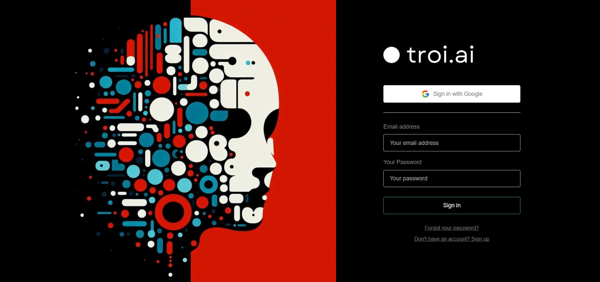
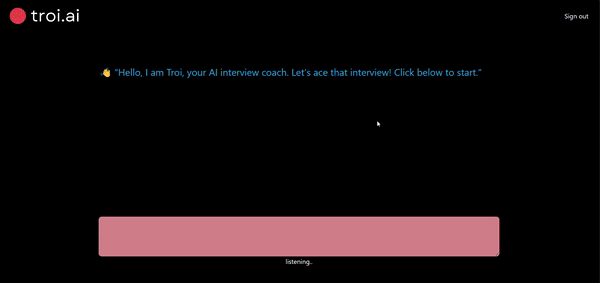

# Troi.AI - AI Interview Simulator

Troi.AI is an AI-powered interview simulator designed to provide a conversational interface for interview practice. By submitting the job description and resume, the system initiates interview-like interactions using both audio and text formats.

## Features

- **Chat Interface:** Engage in interview-like conversations through text and voice inputs.
- **AI Questioning:** Utilizes AI algorithms to generate interview questions based on submitted job descriptions and resumes.
- **Audio Interaction:** Offers voice-based interaction for answering questions.
- **Typing Support:** Allows candidates to respond to questions through typing.

### Usage

1. **Submit Job Description and Resume:** Provide the necessary details to initiate the interview simulation.
2. **Engage in Interview:** Answer questions posed by Troi.AI using either voice or text input.
3. **Review Performance:** Get feedback on your answers and performance during the simulation.

## Login Page

## Main page

## Contributing
Contributions to enhance the functionality, accuracy, or expand the knowledge base of Medezy are welcome! Feel free to submit pull requests, report issues, or suggest improvements.

## License

MIT License

Copyright (c) 2024 Prathamesh Desai

Permission is hereby granted, free of charge, to any person obtaining a copy
of this software and associated documentation files (the "Software"), to deal
in the Software without restriction, including without limitation the rights
to use, copy, modify, merge, publish, distribute, sublicense, and/or sell
copies of the Software, and to permit persons to whom the Software is
furnished to do so, subject to the following conditions:

The above copyright notice and this permission notice shall be included in all
copies or substantial portions of the Software.

THE SOFTWARE IS PROVIDED "AS IS", WITHOUT WARRANTY OF ANY KIND, EXPRESS OR
IMPLIED, INCLUDING BUT NOT LIMITED TO THE WARRANTIES OF MERCHANTABILITY,
FITNESS FOR A PARTICULAR PURPOSE AND NONINFRINGEMENT. IN NO EVENT SHALL THE
AUTHORS OR COPYRIGHT HOLDERS BE LIABLE FOR ANY CLAIM, DAMAGES OR OTHER
LIABILITY, WHETHER IN AN ACTION OF CONTRACT, TORT OR OTHERWISE, ARISING FROM,
OUT OF OR IN CONNECTION WITH THE SOFTWARE OR THE USE OR OTHER DEALINGS IN THE
SOFTWARE.
